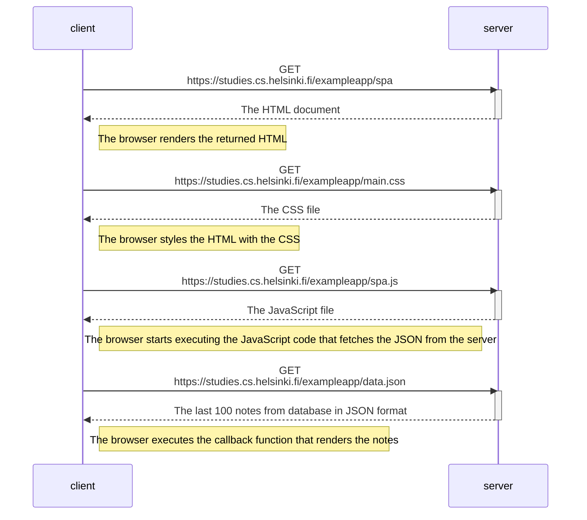

```mermaid
sequenceDiagram
  participant client
  participant server

  client->>server: GET <br /> https://studies.cs.helsinki.fi/exampleapp/spa
  activate server
  server-->>client: The HTML document
  deactivate server

  Note right of client: The browser renders the returned HTML

  client->>server: GET <br/> https://studies.cs.helsinki.fi/exampleapp/main.css
  activate server
  server-->>client: The CSS file
  deactivate server

  Note right of client: The browser styles the HTML with the CSS

  client->>server: GET <br /> https://studies.cs.helsinki.fi/exampleapp/spa.js
  activate server
  server-->>client: The JavaScript file
  deactivate server

  Note right of client: The browser starts executing the JavaScript code that fetches the JSON from the server

  client->>server: GET <br /> https://studies.cs.helsinki.fi/exampleapp/data.json
  activate server
  server-->>client: The last 100 notes from database in JSON format
  deactivate server

  Note right of client: The browser executes the callback function that renders the notes
```
